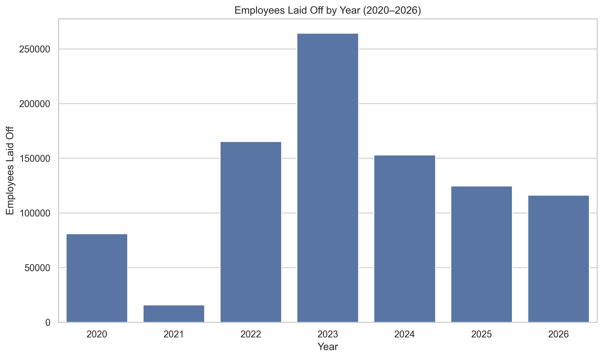
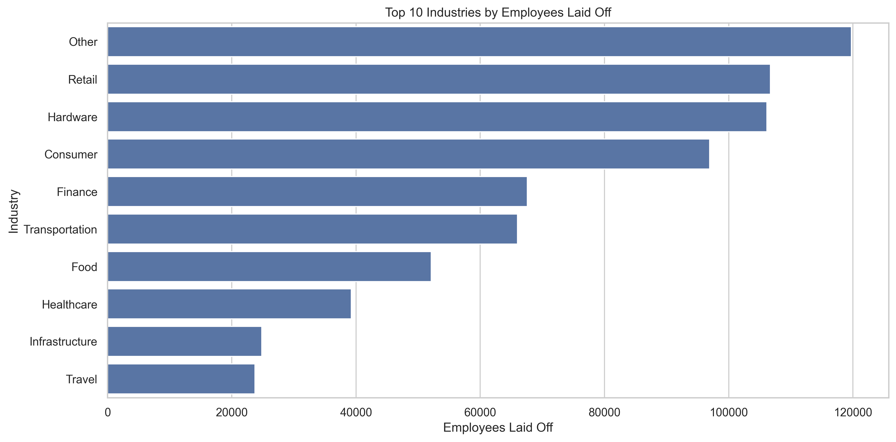
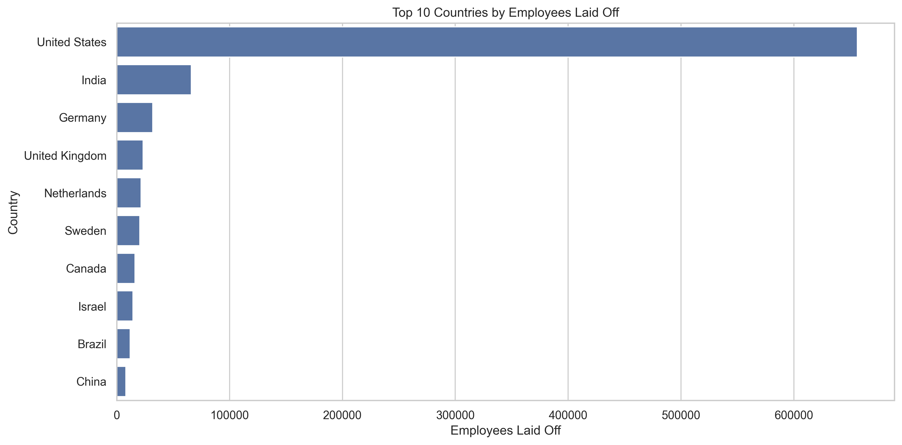
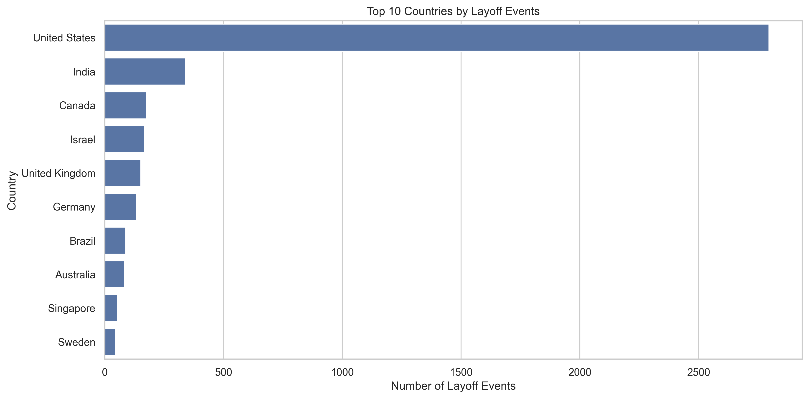
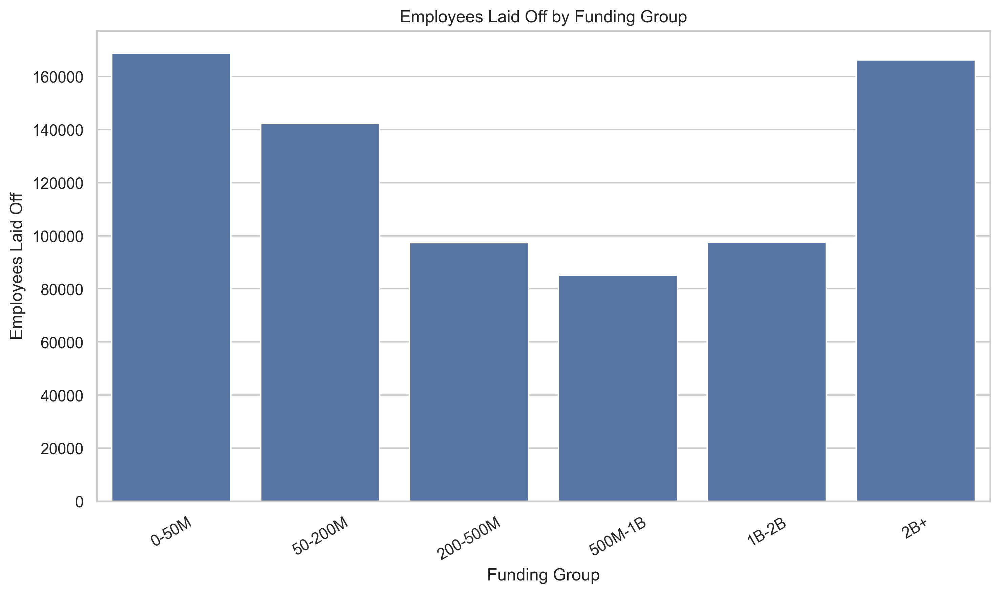
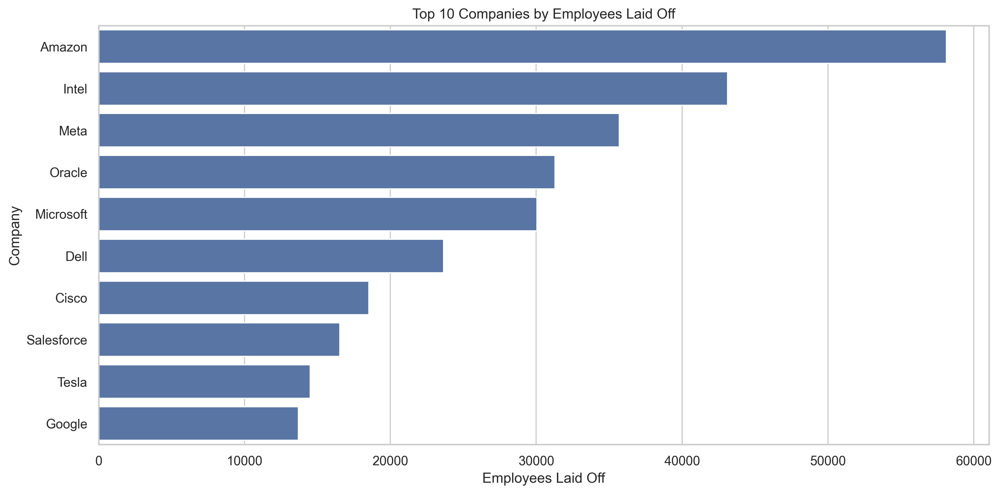

# Global Layoff Intelligence Analysis

## Overview

Analyzed 4,428 global layoff events from 2020–2026 to identify workforce reduction trends across industries, countries, company stages, funding levels, and organizations.

**Tools:** Python, Pandas, NumPy, Matplotlib, Seaborn

---

## Business Questions

- How have global layoff trends evolved from 2020–2026?
- Which industries experienced the highest workforce reductions?
- Which countries were most affected?
- Which company stages are most vulnerable to layoffs?
- Does funding influence layoff magnitude?
- Which companies conducted the largest layoffs?

---

## Key Visualizations

### Global Layoff Trend

**Insight:** Layoffs peaked in 2023, with over 264,000 employees affected, making it the most severe workforce reduction year in the dataset.

---

### Industry Analysis

**Insight:** Retail, Hardware, and Consumer sectors experienced the largest workforce reductions, highlighting the impact on technology-driven and consumer-focused businesses.

---

### Country Analysis

**Insight:** The United States dominated global layoff activity, while India ranked second in both layoff frequency and employees affected.

---

### Company Stage Analysis

**Insight:** Post-IPO companies accounted for the majority of workforce reductions, suggesting mature firms were more likely to undertake large-scale restructuring.

---

### Funding Analysis

**Insight:** Layoffs occurred across all funding levels, indicating that access to capital alone did not guarantee workforce stability.

---

### Top Companies by Layoffs

**Insight:** Amazon, Intel, Meta, Oracle, and Microsoft recorded the largest workforce reductions during the study period.

---

## Key Findings

- Layoff activity reached its highest level in 2023.
- Finance recorded the highest number of layoff events.
- Retail and Hardware experienced the largest workforce reductions.
- The United States accounted for the majority of layoffs globally.
- Post-IPO organizations were the most affected company stage.
- Funding showed only a weak relationship with layoff magnitude.
- Large technology-focused enterprises dominated the top layoff rankings.

